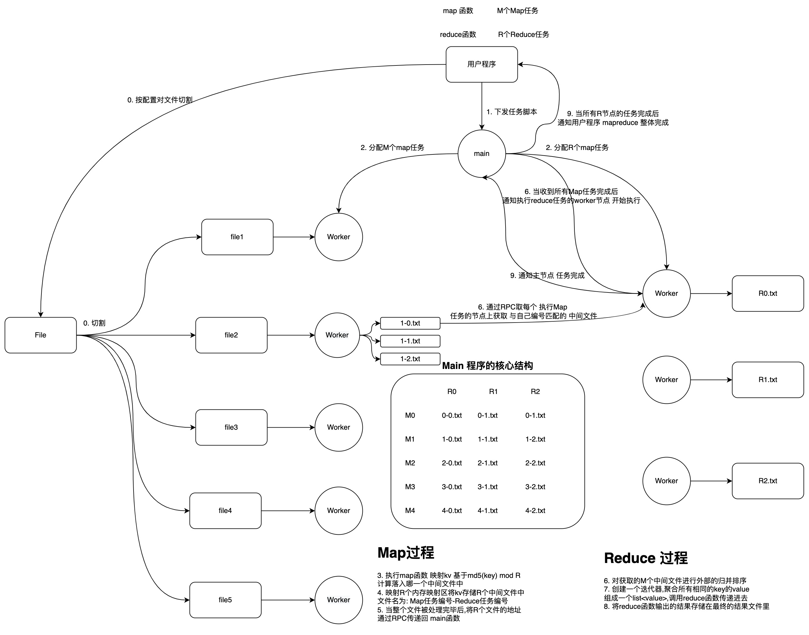
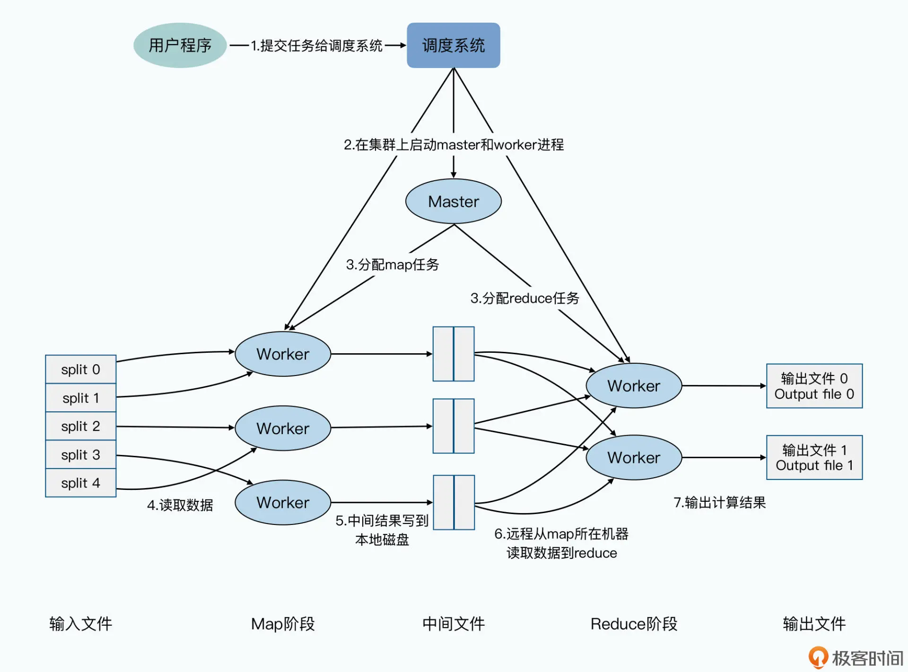

[https://static.googleusercontent.com/media/research.google.com/zh-CN//archive/mapreduce-osdi04.pdf](https://static.googleusercontent.com/media/research.google.com/zh-CN//archive/mapreduce-osdi04.pdf)

[https://www.bilibili.com/video/BV1qK4y1p7gT](https://www.bilibili.com/video/BV1qK4y1p7gT?p=3)

## MapReduce 解决了什么问题

2004 年谷歌发布 MapReduce，解决在面对大规模数据集的一些问题：

1. 统计词频，PageRank
2. 大规模词频排序
3. 对多台机器上的文件进行 grep

MapReduce 是为了在普通的机器上运行大规模并行数据处理抽象出的编程模型，解决多机并行协同，网络通信，处理错误，提高执行效率等通用性问题。

### MapReduce 是什么

将一组输入的数据应用 map 函数返回一个 kv 对作为中间数据集，并将具有相同 key 的数据输入到一个 reduce 函数，最终返回处理后的结果。

成熟的工业级实现 MapReduce 就是一个利用普通机器组成大规模计算集群进行并行的、高容错、高性能的数据处理函数框架。

## 应用场景

- 分布式 Grep
- URL 访问频次统计
- 倒转 Web 链接图
- 每个主机的关键词向量
- 倒排索引
- 分布式排序

## 如何实现

1. 用户程序将输入文件切割成 M 块
2. MapReduce 程序有一个 Master 节点和多个 Worker 节点，主节点负责将 M 个 Map 任务和 R 个 Reduce 任务分配给 Woker 节点
3. Map 任务节点读取输入区块，并解析为 k/v 对，然后输入到用户定义的 map 函数，map 函数产生的中间 k/v 对缓存在内存
4. 缓存的函数被周期性的有划分函数分成 r 块，并写入磁盘，在磁盘中的位置会被传回 Master 节点，Master 节点复制将这些位置传给 Reduce 节点
5. Reduce 节点得到通知后，会去磁盘对应的位置读取文件，并按照 key 排序
6. 排序好后将 key 和与它关联的一组 value 传递给用户定义的 reduce 函数，reduce 函数的输出会写到由 reduce 划分过程划分出来的最终输出文件的末尾
7. 所有任务完成后，Master 节点唤醒用户程序，程序 return 到用户代码中。
8. Master 节点会存储每个 map 和 reduce 任务的状态，和每台机器的 ID

## 工程优化

### Worker 节点容错

大规模集群每个节点都出问题和每个节点都不出问题的概率都很低，呈正态分布。

1. 执行 map 任务的节点，通过周期性的 ping-pong 心跳机制让 Master 节点感知心跳，心跳超时则认为任务失败。重新将这个任务传递给其他 worker 节点执行。master 节点需要维护任务队列记录哪些任务未完成，哪些任务已经完成。
2. 执行 reduce 任务的节点，reduce 的输出是一个持久性文件，因此每次 reduce 被重新分配都需要重命名一个新的文件，防止文件破坏和冲突。
3. Master 节点，任务执行的元数据产生的中间态可以保持在一个恢复点文件中，节点崩溃重启后可以读取最近恢复点。
4. 副作用，所有持久化操作都不可避免产生副作用。解决方案是将执行过程中产生的文件先保存在临时文件中，提交文件时再将其原子重命名为最终文件（Linux 内核中，重命名是原子的）

### 加速并行处理的过程

利用局部性，将 map 任务分配给本来就有所有输入文件的节点上,来减少一次网络调用使得性能得到提升。

任务粒度，一些经验性的配置是 map 任务通常为输入文件总大小除以 64M 的值(这源于底层的分布式文件系统是以 64m 为一个 chuck 进行存储的),reduce 的数量通常是 map 任务的一半。同时 为了发挥机器本身的多核特性,一台机器上可以指定多个 map reduce 任务来执行 通常是任务总数的百分之一。

备用任务，当仅剩下 1%的任务时,可以启动备用任务,即同时在两个节点上执行相同的任务。这样只要其中一个先返回即可结束整个任务,同时释放未完成的任务所占用的资源。
